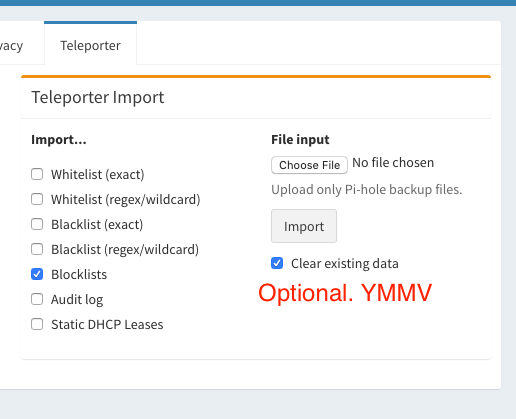

# Bulk Upload Blocklists

I failed to read the input box that shows you can bulk upload on Pihole 5.0.
Due to this fact, I wrote something that generates a teleporter-compliant file
to import.

## To generate

```
$ ./generate-adlist blocklists
a adlist.json
adlist-generated-2020-05-14T18:49:35.tar.gz has been created and can now be imported via Pihole Teleporter
```

## To upload

Use the 'Teleporter' option in 'Settings'. Decide whether you'd like to clobber your current lists.




